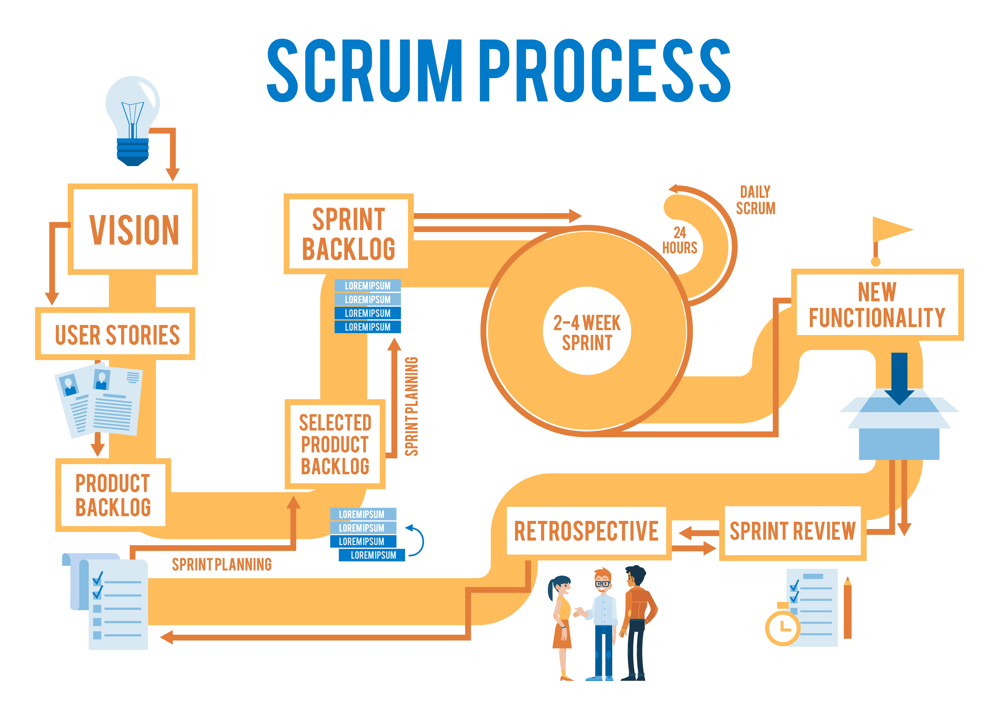

<div align="justify">

<div align="right">
Rafael Martín Mayor.
</div>

# Informe de SCRUM

## Introducción




¿Qué es SCRUM?

Scrum es un marco de gestión de proyectos de metodología ágil que ayuda a los equipos a estructurar y gestionar el trabajo mediante un conjunto de valores, principios y prácticas. El método scrum anima a los equipos a aprender a través de las experiencias, a autoorganizarse mientras abordan un problema y a reflexionar sobre sus victorias y derrotas para mejorar continuamente.

En este informe, se describirá el proceso de implementación de **SCRUM** en una empresa de desarrollo de software.

A continuación, se presentan los pasos que se siguieron para implementar SCRUM:

1. Se formó un equipo de desarrollo de software.
2. Se establecieron los roles de los miembros del equipo.
3. Se creó un backlog de producto.
4. Se planificó la primera iteración.
5. Se llevó a cabo la primera iteración.
6. Se realizó una retrospectiva de la primera iteración.
7. Se planificó la segunda iteración.
8. Se llevó a cabo la segunda iteración.
9. Se realizó una retrospectiva de la segunda iteración.
10. Se repitió el proceso de planificación, ejecución y retrospectiva para las siguientes iteraciones.

SCRUM tiene varios beneficios, entre ellos:

- Mayor transparencia en el proceso de desarrollo.
- Mayor flexibilidad para adaptarse a los cambios en los requisitos del proyecto.
- Mayor colaboración entre los miembros del equipo.
- Mayor calidad del producto final.

| Rol | Responsabilidades |
| --- | --- |
| Scrum Master | Asegurarse de que se sigan las prácticas de SCRUM. |
| Product Owner | Definir y priorizar el backlog de producto. |
| Equipo de desarrollo | Desarrollar el producto y cumplir con los objetivos de la iteración. |

> "SCRUM es un marco de trabajo ágil para la gestión y desarrollo de proyectos de software" .

```python
# Ejemplo de implementación de SCRUM en Python

class Scrum:
    def __init__(self, backlog, equipo):
        self.backlog = backlog
        self.equipo = equipo

    def planificar_iteracion(self):
        print("Planificando iteración...")
        # Código para planificar la iteración

    def ejecutar_iteracion(self):
        print("Ejecutando iteración...")
        # Código para ejecutar la iteración

    def retrospectiva_iteracion(self):
        print("Realizando retrospectiva de la iteración...")
        # Código para realizar la retrospectiva de la iteración

# Ejemplo de uso
backlog = ["Funcionalidad 1", "Funcionalidad 2", "Funcionalidad 3"]
equipo = ["Desarrollador 1", "Desarrollador 2", "Desarrollador 3"]
scrum = Scrum(backlog, equipo)
scrum.planificar_iteracion()
scrum.ejecutar_iteracion()
scrum.retrospectiva_iteracion()
```

**Vídeo explicativo de SCRUM**: [¿Qué es SCRUM?](https://www.youtube.com/watch?v=sLexw-z13Fo)

*Descripción SCRUM página oficial*: [Scrum.org](https://www.scrum.org/resources/what-is-scrum).

~~Final del proyecto~~
</div>